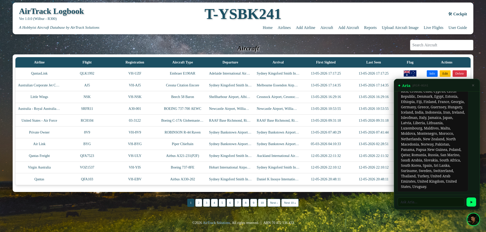
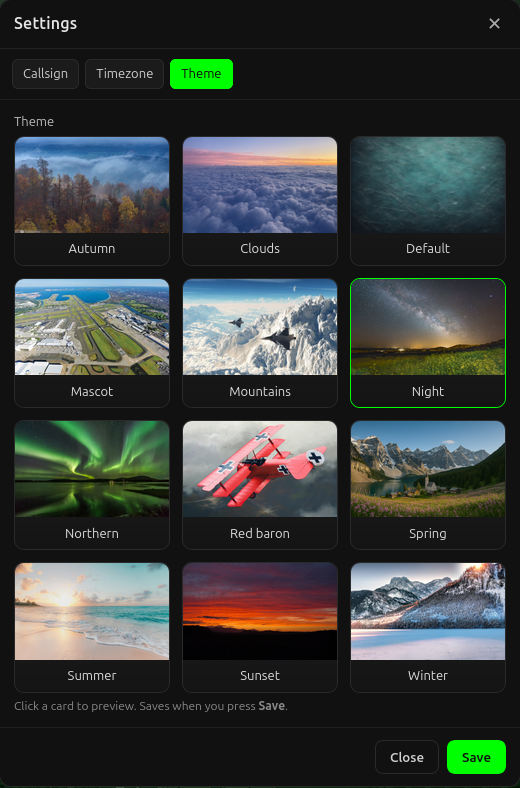

# AirTrack 1.0.0 "Wilbur"

### Self-hosted aircraft tracking for people who actually care what's flying overhead.

[](https://github.com/Subhuti/AirTrack-Logbook)
[](https://github.com/Subhuti/AirTrack-Logbook)
[](https://github.com/Subhuti/AirTrack-Logbook)
[](https://discord.gg/NsmUxZmuY)

---


AirTrack is a locally-installed, offline-first aircraft tracking suite built for planespotters, aviation enthusiasts, and serious aircraft data collectors. It runs entirely on your own hardware — Linux desktop or Raspberry Pi — with no cloud, no subscriptions, and no external servers of any kind.

Your data never leaves your machine. You are the Captain.

---

## Why AirTrack?

Most aviation tools are built around the airline industry. They tell you what gate your flight is at, or show a map of current commercial traffic. That's not what planespotters need.

AirTrack is built around the question you actually ask when something flies overhead: **what is that, where is it registered, who operates it, and have I seen it before?**

It answers that question from your own database, on your own hardware, with no API keys, no rate limits, and no dependency on anyone else's server being up.

---

## What's included

**A registration database you can actually use offline.**
AirTrack ships with civil aircraft registrations for 78 countries — over 417,000 aircraft records — bundled and ready to query the moment you install. No external lookups. No API keys. When you see a registration, AirTrack already knows it.

| Stat | Value |
|:-----|:------|
| Countries covered | 78 |
| Total registration records | 417,958+ |
| Data source | Official civil aviation authorities |
| Requires internet | No |

**A full sightings and flights logbook.**
Every aircraft you log, every sighting, every image — all stored locally in MariaDB. Search by registration, airline, type, country, ICAO or IATA code. Build a personal history of everything you've spotted.

**Aircraft photo management.**
Upload and attach photos directly to aircraft records. All images stored locally. No cloud storage, no external hosting.

**Aria — your AI assistant, running locally.**
Aria is an AI assistant built into AirTrack, powered by a local language model (phi4-mini via Ollama). Ask her questions in plain English: *"How many Boeing 737s have I logged?"* or *"What airlines operate the A320 family?"* — she queries your own database and answers from it. No data sent anywhere.

**ADS-B integration.**
AirTrack is designed to work alongside dump1090, FR24, and other ADS-B feeders. Connect your SDR setup and AirTrack becomes the logging and identification layer on top of your live feed.

**Android companion app.**
AirTrack Mobile is a read-only companion app for field spotting. Export your database to the phone and use it offline at the airport or airshow.

**Multi-node capable.**
Run a fleet of Raspberry Pis — one as the server, others as field units and kiosks. AirTrack is designed for exactly this kind of distributed home setup.

---

## Screenshots






---

## System requirements

| Component | Requirement |
|:----------|:------------|
| OS | Linux Desktop (Ubuntu / Pop!_OS / Mint) or Raspberry Pi OS 64-bit |
| Docker | Required (installer will install if missing) |
| Docker Compose | Required (installer will install if missing) |
| RAM | 2 GB minimum |
| Storage | SSD recommended; SD card works on Pi |
| Browser | Chrome, Firefox, Edge, or Safari |

For Aria (AI assistant): Ollama with phi4-mini installed on the same machine or reachable on the local network.

---

## Installation

```bash
# 1. Download and unzip the AirTrack package
# 2. Open a terminal in the extracted folder

chmod +x install_airtrack.sh
./install_airtrack.sh
```

When installation completes:

```
http://localhost:5000
```

That's it. AirTrack is running.

---

## Starting and stopping

```bash
./start.sh    # Start AirTrack
./stop.sh     # Stop AirTrack
```

---

## Try it first — AirTrack Lite

Not ready to commit? **AirTrack Lite** is a free, fully functional build with a 100-aircraft cap. Same installer, same interface, same database — just limited in scale. Download it, run it, see if it's for you.

👉 [Download AirTrack Lite 1.0.0 "Wilbur"](https://airtracksolutions.com.au)

---

## Roadmap

- 🗺️ Offline map integration for spotting locations
- 📈 Sightings analytics and fleet reporting
- 🔄 Optional LAN syncing between nodes
- 📡 Field Unit enhancement (YOLO/OCR aircraft registration capture)
- 🏆 "Legends of Flight" extended release series

---

## Release codenames

AirTrack releases are named after aviation pioneers.

| Version | Codename | Person |
|:--------|:---------|:-------|
| 0.9.x | Orville | Orville Wright — pilot of the first controlled powered flight, Kitty Hawk, 17 December 1903 |
| 1.0.0 | Wilbur | Wilbur Wright — aviation innovator and co-architect of powered flight |

Future releases will continue through aviation history, with particular attention to Australian pioneers.

---

## Community

AirTrack has a Discord server — come say hello, share your setup, or ask questions.

👉 **[Join AirTrack Solutions on Discord](https://discord.gg/NsmUxZmuY)**

---

## Philosophy

AirTrack is built on a simple principle: **your data belongs to you.**

- No cloud accounts required
- No telemetry or usage tracking
- No dependency on AirTrack Solutions' servers
- No subscriptions
- Works completely offline
- Runs on hardware you already own

If AirTrack Solutions disappeared tomorrow, every installation would keep running exactly as it does today.

---

## Development story

AirTrack started in late 2022 as a Raspberry Pi field spotting experiment — a single Pi at an airport trying to capture registration numbers. It grew from there through two-plus years of late nights, fieldwork, database disasters, and relentless iteration.

By 2025, it had become a full multi-node tracking suite with a bundled registration database, AI assistant, Android companion, and a small but growing community of aviation enthusiasts running it on their own hardware.

Version 1.0.0 "Wilbur" is the point where it stopped being a prototype and started being something you'd actually recommend to a fellow spotter.

---

## License

AirTrack is **proprietary software**. Redistribution or resale without written permission is prohibited. All data you store with AirTrack belongs entirely to you. AirTrack Solutions does not collect or access your information.

AirTrack Lite is provided free of charge for personal, non-commercial use.

---

## Acknowledgements

- **Trevor** — Founder, architect, captain of AirTrack Solutions
- **Samowal** — Creator of the original PHP concept this grew from
- **Bob** — AI co-pilot, code wrangler, and general voice of reason
- Every planespotter who looks up when something flies overhead

---

*Built by aviation enthusiasts, for aviation enthusiasts.*
*Clear skies and smooth landings.*

**[airtracksolutions.com.au](https://airtracksolutions.com.au) · [Discord](https://discord.gg/NsmUxZmuY) · [GitHub](https://github.com/Subhuti/AirTrack-Logbook)**
